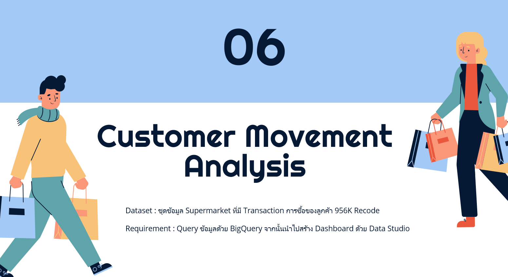
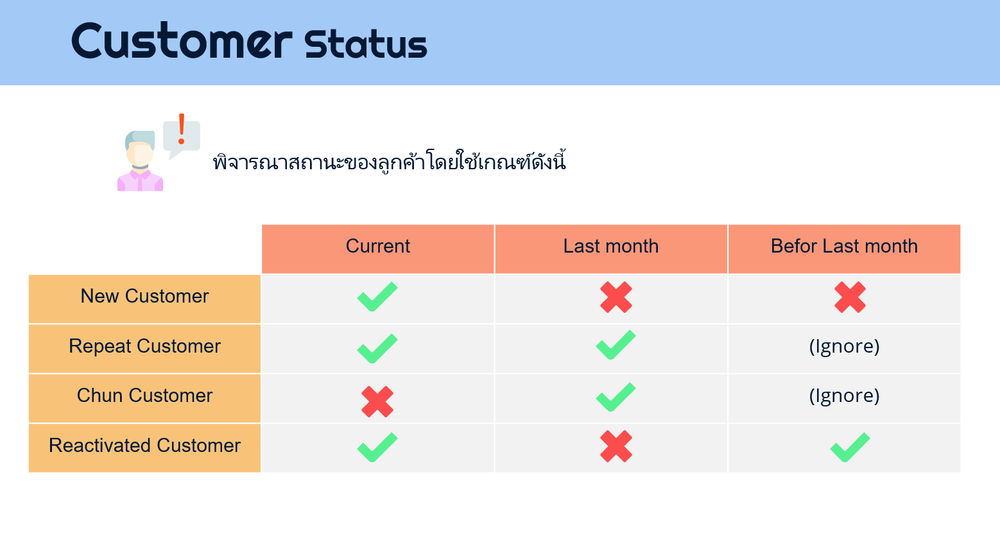
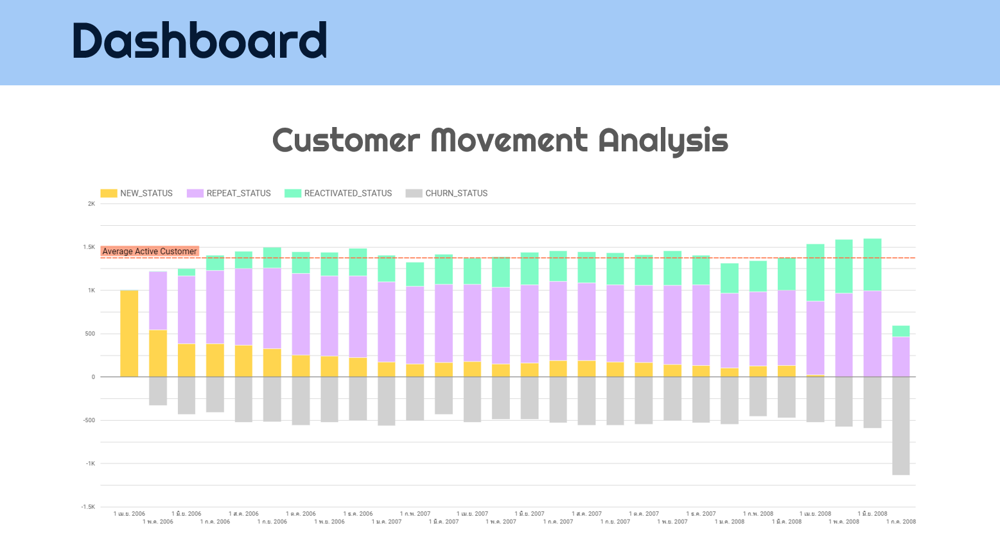

## SQL : [](https://console.cloud.google.com/bigquery?authuser=1&project=bads7105-supermarket&ws=!1m4!1m3!8m2!1s820652359070!2s1eda7f3c5b404e6e97147f163ca9af0d)

```
SELECT 	
	SHOP_MONTH, 
	NEW_STATUS, 
	REPEAT_STATUS, 
	REACTIVATED_STATUS,  
	TOTAL ,LAG(TOTAL, 1)OVER(ORDER BY SHOP_MONTH ASC) as PREVIOUS_TOTAL, 
	REPEAT_STATUS - LAG(TOTAL, 1)OVER(ORDER BY SHOP_MONTH ASC) as CHURN_STATUS
FROM
	(SELECT 
		SHOP_MONTH, 
		COUNT(CASE WHEN STATUS = 'NEW' THEN CUST_CODE ELSE NULL END) as NEW_STATUS, 
		COUNT(CASE WHEN STATUS = 'REPEAT' THEN CUST_CODE ELSE NULL END) as REPEAT_STATUS,
		COUNT(CASE WHEN STATUS = 'REACTIVATED' THEN CUST_CODE ELSE NULL END) as REACTIVATED_STATUS,
		COUNT(STATUS) as TOTAL
	FROM
		(SELECT 
            PREVIOUS_MONTH, SHOP_MONTH, CUST_CODE, 
            CASE
                WHEN DATE_DIFF(SHOP_MONTH, PREVIOUS_MONTH, MONTH) IS NULL THEN 'NEW'
                WHEN DATE_DIFF(SHOP_MONTH, PREVIOUS_MONTH, MONTH) = 1 THEN 'REPEAT'
                WHEN DATE_DIFF(SHOP_MONTH, PREVIOUS_MONTH, MONTH) > 1 THEN 'REACTIVATED'
            ELSE NULL END AS STATUS
        FROM
			(SELECT 
  				LAG(SHOP_MONTH, 1)OVER(PARTITION BY CUST_CODE ORDER BY SHOP_MONTH ASC) as PREVIOUS_MONTH, 
  				SHOP_MONTH, 
  				CUST_CODE
  			FROM
				(SELECT  
					DISTINCT DATE_TRUNC(PARSE_DATE('%Y%m%d', CAST(SHOP_DATE as STRING)),MONTH) as SHOP_MONTH,
					CUST_CODE
					FROM `bads7105-supermarket.supermarket_data.supermarket_data` 
					WHERE CUST_CODE IS NOT NULL
				)
			)
		)
		GROUP BY SHOP_MONTH
	)
ORDER BY SHOP_MONTH
```
